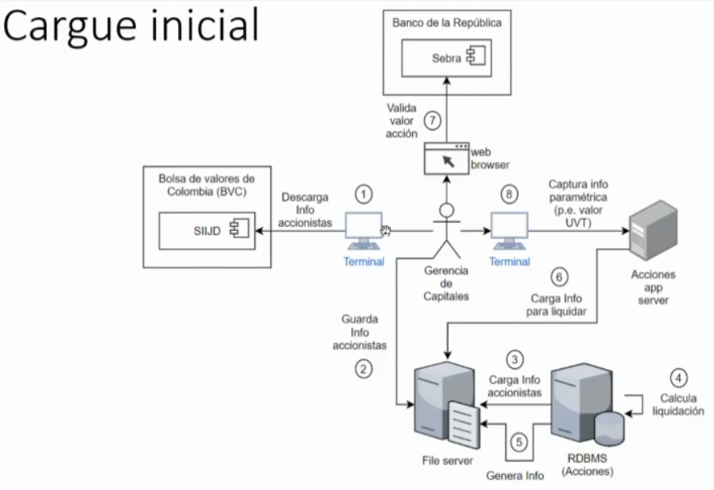
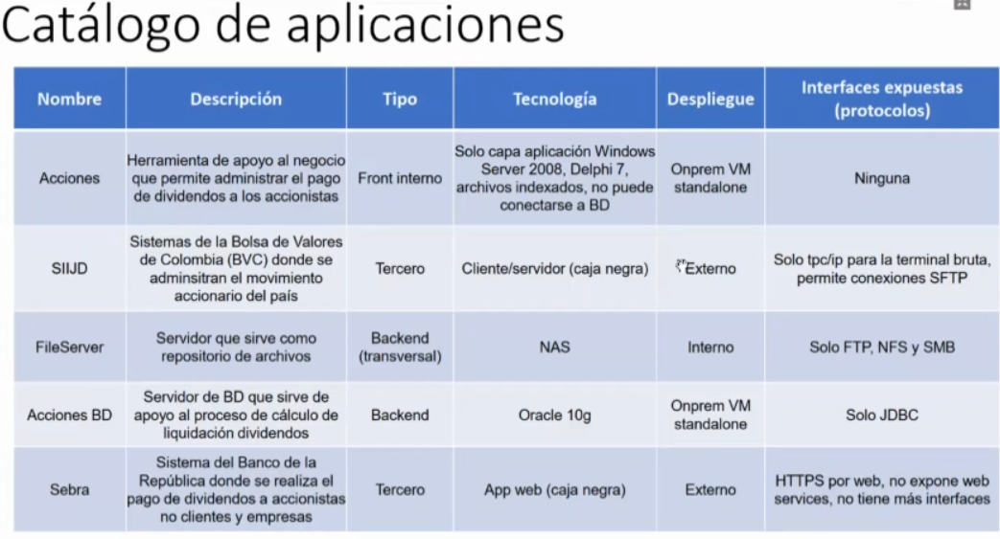
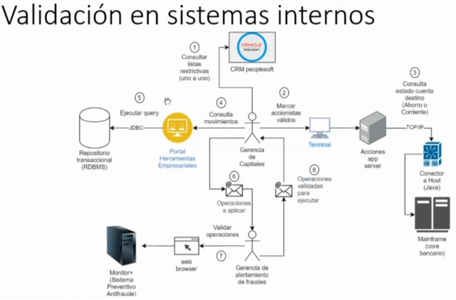
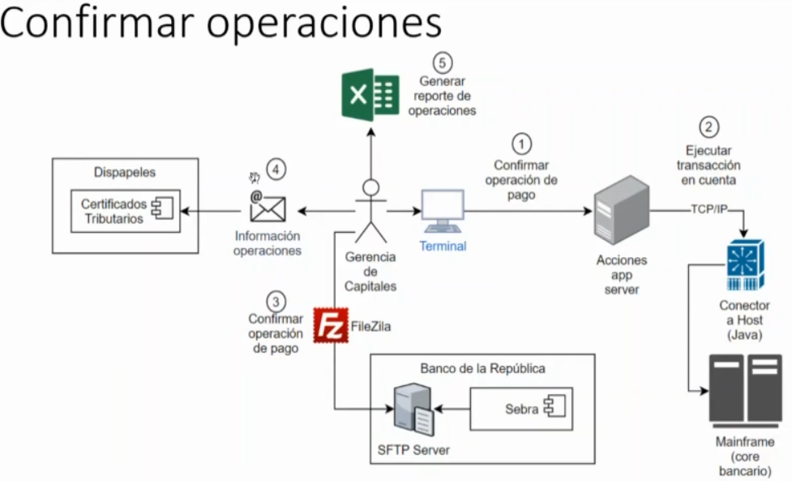
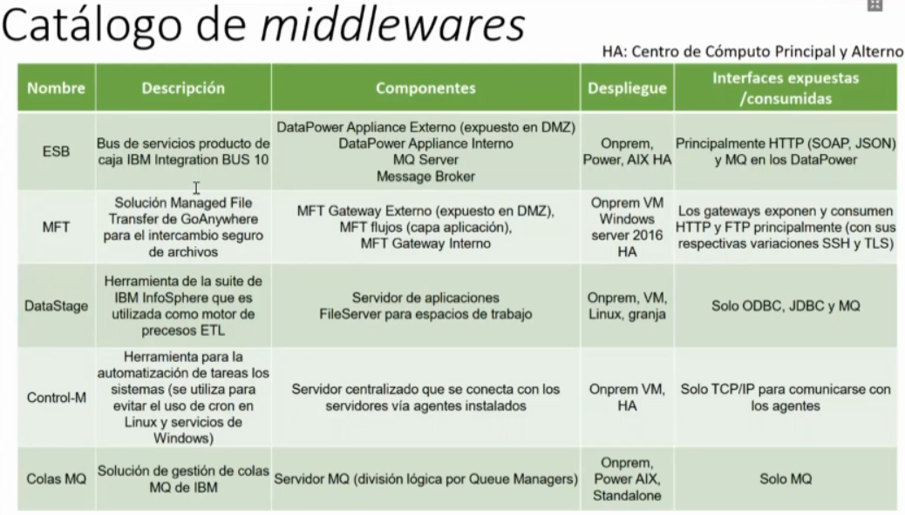
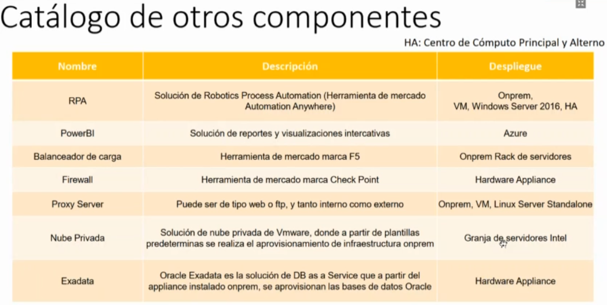

**Contexto del Problema**

A partir de un escenario real de la organización, hemos construido un contexto supuesto en el cual tenemos como objetivo modernizar el sistema de acciones que actualmente apoya la generación de dividendos para los accionistas. El sistema es un aplicativo legado que tiene varios limitantes, por lo cual se decidió modernizarlo, manteniendo y mejorando las funcionalidades que ofrece. Para ello, se debe analizar el contexto del problema y a partir de artefactos arquitectónicos proponer un diseño que contemple la solución desde diferentes puntos de vista arquitecturales.

Las premisas que se tienen en contexto del reemplazo del sistema de acciones son las siguientes. Existen muchas y repetitivas tareas manuales. La aplicación es legada, no tiene soporte y tiene bastantes dificultades para mantener su operación en producción.

Tiene adicionalmente limitantes tecnológicas que no le permiten interactuar con otras aplicaciones. El uso por parte de los usuarios es bastante complejo. Esto se debe a que se utiliza una pantalla negra en modo cliente-servidor, donde se tiene un manual de comandos que se deben ejecutar para poder proceder con el proceso.

Varios hallazgos de seguridad y glosas existen actualmente por fallas que se han presentado en la operación. La infraestructura asociada a la aplicación está en límite de crecimiento, tanto vertical como horizontal, y el software base está fuera de soporte. Se tienen tiempos de proceso elevados de inicio a fin.

Estos tiempos muchas veces se deben a la manualidad y a tiempos muertos que existen dentro de las áreas. Se deben reprocesar varias tareas antes de finalizar el proceso completo debido a que cada uno de los accionistas al pagar sus dividendos se debe revisar en detalle. A continuación, se presenta el diagrama que ilustra uno de los hitos que el proceso lleva a cabo.

El proceso se hace a partir de tres hitos. Este es el primero, el cargue inicial. Dentro del cargue inicial tenemos los siguientes pasos que se ejecutan.

Todo esto con el objetivo de poder obtener y preparar la información para que el proceso pueda ejecutarse. El primero es que el analista de la gerencia vía una terminal se conecta a un sistema que está expuesto por la Bolsa Valores de Colombia, el sistema SIIJD. De allí toma la información de los accionistas y viene y la deposita dentro de un servidor de archivos, las guarda en ese repositorio para que una base de datos relacional tome dicho archivo, lo cargue y por medio de procedimientos PLSQL calcule la liquidación. Cuando la liquidación se termina, la base de datos genera un archivo que vuelve y deposita dentro del file server para que ya **nuestro sistema de acciones, que es el que vamos a modernizar**, tome la información. ¿Esto por qué sucede? Porque el sistema de acciones actualmente no permite trabajar con sistemas de datos relacionales, sino con archivos planos.

Luego el analista se conecta al Banco de la República por medio de un portal web que se expone con un usuario y una contraseña, valida el valor de la acción y viene y la almacena como información paramétrica dentro del sistema de acciones, como también lo hace con otros valores como son el UVT. Hasta ahí es el primer hito de Cargue Inicial de Información. A continuación, se presenta un cuadro que contiene el listado de las aplicaciones del diagrama que acabamos de ver, donde se especifica la tecnología, el despliegue y las interfaces expuestas o los protocolos.

Estos datos deben acotar la solución que se plantee, pero se podrán hacer suposiciones con sus respectivas justificaciones.

El segundo hito es la validación en sistemas internos. Los sistemas internos que aquí mostramos son nuestro CRM, nuestro Core Banking, nuestro repositorio transaccional de operaciones y nuestro sistema de alertamiento preventivo antifraude.

¿Cómo funciona y cuáles son los pasos? Primero el analista lo que hace es con cada uno de los accionistas, consulta las listas restrictivas para mirar si se puede proceder con la operación o no. Luego de ello **marca cada uno de estos accionistas válidos dentro de nuestro sistema de acciones**. **El sistema de acciones a su vez cuando se están marcando lo que hace es consultar en línea a través de un conector Java construido a la medida** si las cuentas tanto de ahorro como corrientes asociadas a ese cliente están activas o están en un estado válido para poderle hacer pago a los dividendos.

Luego de esto va a otro sistema que es un portal de herramientas empresariales, un portal hecho a la medida también en Java y se conecta a la base de datos transaccional para mirar pues cuáles son las operaciones que ha ejecutado en el último evento. Todo esto con el objetivo de construir un correo electrónico donde se acumulen las operaciones que se van a aplicar con todo el detalle para que otra gerencia que es la de alertamiento de fraudes tome la información y la valide dentro del sistema Monitor Plus. Esto lo hacen a través también de un sitio web que está interno dentro de la organización.

Por último, lo que hace alertamiento es generar un correo electrónico que contiene un archivo plano en Excel (CSV) que contiene las operaciones que validó para que sean ejecutadas y de esa manera termina el segundo hito.

Como ya lo hemos visto también se comparte aquí el catálogo de aplicaciones del diagrama que acabamos de ver. Aquí nuevamente prevalece la tecnología del despliegue y las interfaces expuestas.

Acá hay un detalle adicional y es que estos sistemas al ser de la organización están desplegados en modo HA, quiere decir que están tanto en el centro de cómputo principal como alterno. Hay que tener en cuenta que nuestro CRM está siendo migrado a otro sistema.

Por último y el tercer hito es la confirmación de las operaciones.

Miremos qué sucede allí. El analista nuevamente **entra al sistema de acciones**, confirma la operación de pago y allí se ejecuta vía nuevamente el conector Java que tenemos las transacciones en nuestro Core de la organización. Luego como existen accionistas que no tienen cuentas activas aquí existe el mecanismo de hacerlo a través del Banco de la República.

El analista lo que hace es generar un archivo con una estructura que el Banco de la República nos expone y por medio de una herramienta instalada en su máquina local como es FileZilla sube el archivo confirmando las operaciones de pago. Luego de hacer todo este proceso se arma otra estructura que nos provee Dispapeles para que se puedan generar los certificados tributarios de las operaciones que construimos. Dispapeles envía esto vía correo electrónico o vía físico según esté parametrizado por cada uno de los clientes en el CRM.

Por último, se genera un reporte de las operaciones que se realizaron. Este reporte es de tipo ejecutivo, es agregado, muestra el total en valor del monto de las acciones, muestra cuáles fueron los accionistas que se vieron beneficiados de esta operación y esto tiene pues un tinte gerencial. Nuevamente tenemos el catálogo de las aplicaciones que se ilustran en el diagrama anterior y aquí pues vemos ya que hay unas herramientas que tienen algunas limitaciones como FileZilla que no pueden seguir funcionando.

Adicional a esas aplicaciones tenemos un catálogo de Middleware. Son sistemas que nos permiten habilitar otros aplicativos y otros procesos dentro de la organización. ¿Cuáles son ellos? Tenemos un bus de servicios con su tecnología IBM, tenemos la solución de intercambio seguro de archivos, la solución Go Anywhere de MFT, tenemos el motor del proceso ETL de IBM también, Data Stage, tenemos una herramienta de automatización de tareas dentro de los servidores, dentro de los sistemas.

¿Esto con qué objetivo? De evitar el uso de Chrome y de servicios de Windows, manteniendo obviamente un gobierno. Tenemos también el sistema gestor de colas que es de IBM y tenemos obviamente su despliegue en cada uno de estos componentes dentro del centro de cómputo principal y el centro de cómputo alterno. Aquí, a diferencia de los otros cuadros, se exponen las interfaces tanto expuestas como consumidas, las principales, las más utilizadas, las más utilizadas se exponen aquí.

Por último, tenemos otro catálogo de componentes dentro de la organización. Son componentes que vale la pena resaltar, pero pueden ser mucho más extensos de los que se listan acá. Se puede hacer la suposición de utilizar otros componentes.

Estos son componentes que podrían existir dentro de un datacenter de cualquier organización. Está la solución de Robotics de Automation Anywhere. Tenemos la solución de reportería de Power BI de Microsoft.

Tenemos balanceadores de carga, tenemos Firewall, tenemos Proxy Server, tenemos herramientas de monitoreo de bases de datos, tenemos herramientas de DRP, todas las herramientas que pueden tenerse dentro de una organización. Antivirus para los servidores, para las estaciones de trabajo. Tenemos una solución de nube privada, que es la evolución de las máquinas virtuales de VMware, pero ya aprovisionándolas desde unas plantillas predefinidas.

Tenemos también la solución de Exadata, que es lo que conocemos como la base de datos como servicio, donde se aprovisionan las bases de datos Oracle y donde se están recogiendo las bases de datos que están instanciadas en máquinas virtuales actualmente. Por último, lo que se espera de la solución es que se creen vistas arquitectónicas que nos detallen la solución. Se deben construir cuatro vistas arquitectónicas:

- **La primera** es una **arquitectura de integración e información**: Allí se espera ver todo un detalle de cuáles son los componentes de integración y cuál es el correcto manejo que se le debe dar a los datos para todo el contexto del proceso.
- También tenemos que construir la **vista de arquitectura de software** para la aplicación de acciones, eligiendo sea una solución monolítica o tradicional o cualquier otra arquitectura de software que se proponga.
- Y también la **vista de infraestructura** para el mismo aplicativo que la soporte. Tienen que estar muy alineadas una de la otra.
- Por último, se propone crear una **vista de arquitectura de seguridad** para todo el contexto, donde se puedan observar cuáles son los controles desde TI, desde tecnología, que se deben aplicar en las diferentes partes del proceso.

Pueden hacer cualquier suposición que aplique, siempre y cuando se justifique su elección.